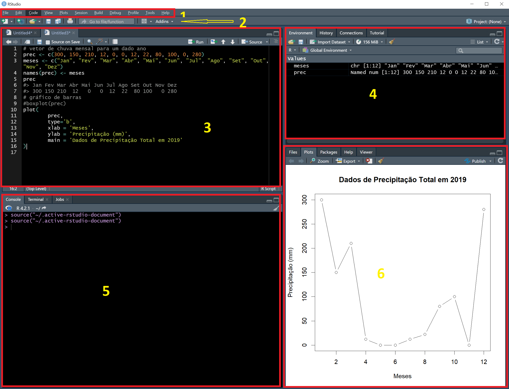
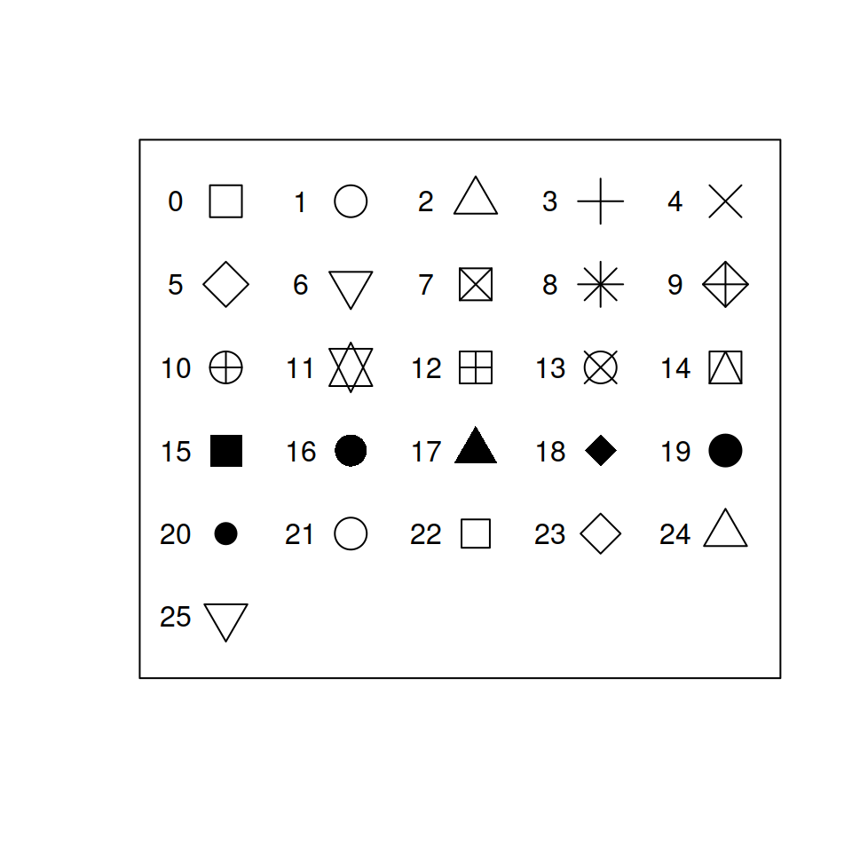

# Introdução
<p style="text-align:justify">R é uma linguagem de programação gratuita de código aberto usada principalmente para computação estatística e gráficos. R é uma linguagem interpretada semelhante a Python, onde você não precisa compilar primeiro para executar seu programa. Depois de criar seu programa, você pode executá-lo em uma ampla variedade de plataformas UNIX, Windows e MacOS.</p>

<p style="text-align:justify">R é uma linguagem específica de domínio de código aberto, explicitamente projetada para ciência de dados. Muito popular em finanças e academia, R é uma linguagem perfeita para manipulação, processamento e visualização de dados, bem como computação estatística e aprendizado de máquina.</p>

<p style="text-align:justify">Como qualquer outra linguagem de programação, R também suporta extensão na forma de pacotes, portanto, os desenvolvedores podem criar seus próprios pacotes e reutilizá-los quando necessário.</p>

# Instalação do R
<p style="text-align:justify">A instalação padrão da linguagem R é feita a partir do <a href="https://cran.r-project.org/">CRAN (The Comprehensive R Archive Network)</a>, uma rede formada de servidores espalhadod pelo mundo que armazena versões atualizadas do código fonte e executável (Windows), assim como a documentação da linguagem R.</p>

# Instalação do RStudio
<p style="text-align:justify">RStudio é um ambiente de desenvolvimento integrado para linguagem R (IDE - <i>integrated development environment</i>), porém pode rodar <i>scripts</i> SQL, C, C++ e Python. A vantagem se se poder trabalhar com IDE é que ela disponibiliza ferramentas de apoio ao desenvolvimento de códigos em linguagem de programção. Para <i>download</i> do RStudio acesse o endereço <a href="https://www.rstudio.com/products/rstudio/download/#download">https://www.rstudio.com/,</a> e escolha a opção <i>RStudio Desktop</i></p>

## Conhecendo a Interface Gráfica do RStudio



A interface do RStudio é divida em 4 painés, e duas barras:
* 1 - Barra de _menu_
* 2 - Barra de ferramentas
* 3 - Painel de _scripts_ e arquivos
* 4 - Painel de variáveis de Ambiente/Histórico/Conexões/Tutorial
* 5 - Painel de _Console/Terminal_ 
* 6 - Painel de Árvore de Arquivos/Gráficos/Pacotes/Ajuda/Visualizador

## Obter e Configurar o ambiente de trabalho

<p style="text-align:justify">Para obter o ambiente de trabalho atualmente em uso pelo RStudio utilizamos a função <mark style="background-color:#F4F4F4;">getwd()</mark>; esta função vem do termo em inglês: <i>Get Working Directory</i>, traduzido para o portugês como "Obter Ambiente de Trabalho". No sistema operacional Windows, por padrão, o RStudio configura o ambiente de trabalho em "C:/Usuários/Nome_do_Usuário/Documentos"</p>.
<p style="text-align:justify">Para configurar um ambiente de trabalho diferente do padrão utilizamos a função <mark style="background-color:#F4F4F4">setwd()</mark>. Esta função tem nome bem sugestivo na lingua inglesa, a saber: <i>Set Working Directory</i>, "Configurar Ambiente de Trabalho".</p>


```R

```

### Exercício Prático - Ambiente de trabalho
**Instrução 1/2**
* Use a janela console do RStudio para obter o atual diretório de trabalho em uso no seu computador.


```R

```

**Instrução 2/2**
* Configure seu ambiente de trabalho para `'C:/Users/Seu_nome_de_usario/Downloads'`

_Atenção: Em seu nome_de_usuario insira seu nome de usuário._


```R

```


```R

```

# Operadores Aritméticos e de Atribuição em R

|Operador|Função|
|:------:|:----:|
| +      | Soma |
| -      | Subtração |
| /      | Divisão |
| *      | Multiplicação |
| %%     | Resto da divisão |
| %/%    | Parte inteira divisão |
| ^      | Potenciação |
| **     | Potenciação |
| <-     | Atribuição |
| =      | Atribuição |

## Exercício Prático - Operadores Aritméticos e de Atribuição

**Instrução 1/3**
* Obter o resto da divisão entre os números inteiros 10 e 3.


```R

```

**Instrução 2/3**
* Obter a parte interira da divisão de 10 por 3.


```R

```

**Instrução 3/3**
* Obter o quadrado de um número inteiro qualquer.


```R

```

# Operadores de Comparação em R

| Operador | Significado |
|:--------:|:-----------:|
| == | igual a |
| != | diferente de |
| >  | maior que |
| <  | menor que |
| >= | maior ou igual a |
| <= |menor ou igual a |

# Objeto em R
Em R, um objeto é uma entidade que armazena dados ou informações. Pode ser qualquer tipo de dado, como números, texto, vetores, matrizes, data frames, funções, entre outros. Os objetos em R são criados durante a execução de comandos ou atribuição de valores a variáveis.

Quando se atribui um valor a uma variável em R, está criando um objeto. Por exemplo:

```{r}
# Exemplo 1
int <- 42

# Exemplo 2
letra <- "R"

# Exemplo 3
string <- "R é massa"
```

<p style="text-align:justify">No caso do exemplo 1, o valor 42 é atribuído à variável "int", criando um objeto chamado "int" que armazena esse valor em memória. Podemos usar esse objeto posteriormente em cálculos ou operações. No exemplo 2 o caractere "R" é atribuído à variável letra, criando um objeto do tipo caractere. No exemplo 3 a cadeia de caracteres "R é massa" é atribuída à variável string, criando um objeto do tipo caractere</p>

<p style="text-align:justify">Os objetos em R têm um nome e podem ser referenciados por esse nome em comandos posteriores. É importante notar que, em R, os objetos são armazenados em memória durante a sessão de trabalho e podem ser acessados e manipulados conforme necessário.</p>

<p style="text-align:justify">Nos trechos de código acima se observa o uso do caractere `#`, em R e python este caractere é utilizado para fazer comentário no código, portanto, toda linha que contém este caractere é ignorada na execução do programa.</p>
A seguir é mostrado como fazer comentário com várias linhas.

```{r}
"
Este é um comentário em R utilizando 
várias linhas para documentação de
códigos.
"
```


## Conferindo o contéudo de um objeto
Para conferir o conteúdo de um objeto em R, fazemos uma chamada diretamento pelo nome do objeto de interesse ou através do uso da função _`print()`_


```{r}
int
print(int)
cat(int)
```


42


## Descobrindo o tipo de dados armazenado em um objeto R
Para descobrir o tipo de dados armazenado em um objeto, podemos utilizar a função _`class`_


```{r}
class(int)
class(letra)
class(string)
```


# Estrutura de Dados em R
## Vetores
Vetor em R é um objeto R que armazena um ou mais elementos de valores indexados, ou seja, cada elemento dentro do vetor possui uma posição específica. Para criação de um vetor basta colocar os valores dentro de `c()`. Vetor é uma estrutura de dados especialmente importante em análise de dados. A seguir temos um exemplo de como criar um vetor de inteiros.


```{r}
inteiros <- c(42, 33, 0, -1, 5)
```

Para acessar o primeiro elemento do vetor `inteiros` usamos o comando _`vetor[x]`_, onde _vetor_ é nome atribuido ao vetor e _x_ é o índice do elemento a ser buscado no vetor. Se quisermos mostrar apenas o elemento de índice 1 do vetor `inteiros`, ou seja: filtar apenas o primeiro elemento, basta usar _`inteiros[1]`_


```{r}
# acessar o primeiro elemento de um vetor
inteiros[1]
```


Ao usar um índice negativo para filtrar um vetor estamos pedindo que a saída dos daos do vetor não mostre o elemte relativo ao índice negativo. No código a seguir vamos mostrar todos os elementos do vetor `inteiros`, exceto o quarto elemento (elemento de índice 4).


```{r}
# mostrar todos os elementos do vetor com exeção do elemento de índice 4
inteiros[-4]
```


### Substituição de elementos de um vetor


```{r}
# Substituir o primeiro elemento do vetor "inteiros" por 2
inteiros[1] <- 2
inteiros
```


### Funções básicas aplicadas a vetores

* _`length()`_ Retorna o tamanho de um vetor, ou seja, o número de elementos armazenados no vetor.


```{r}
length(inteiros)
```


#### _`names()`_ Retorna os nomes atribuídos a cada elemento de um vetor


```{r}
# Defini um vetor de números inteiros chamado "dias_semana"
dias_semana <- c(1:7)

# Mostrar na tela do console os dados do vetor
dias_semana

# Checar se o vetor possui nomes associados aos seus elementos
names(dias_semana)
```


```{r}
# Atribuir nomes aos elementos do vetor utilizando a função names()
names(dias_semana) <- c('Domingo', 'Segunda', 'Terça', 'Quarta',
                        'Quinta', 'Sexta', 'Sábado')
```


```{r}
# Checar se o vetor possui nomes associados aos seus elementos
names(dias_semana)
```


```{r}
# Mostrar na tela do console os dados do vetor
dias_semana
```


#### _`attributes()`_ Retorna uma lista com os atributos associados a um vetor.


```{r}
# Verificar se os vetores "inteiros" e "dias_semana"
# possuem algum atributo
attributes(inteiros)
attributes(dias_semana)
```


#### _`seq()`_ Cria uma sequência dentro de um vetor


```{r}
# gerar uma sequência de 1 a 10, saltando 2 números
sequencia <- seq(0, 10, 2)
print(sequencia)
```

    

#### _`rep()`_ Cria uma repetição de um vetor


```{r}
# Gerar uma repetição de três vezes o vetor formado pelos número de 1 a 4
rep(1:4, 3)
```


#### `duplicated()` Mostra a localização de elementos duplicados.


```{r}
# Vetor com números inteiros duplicados
vetor <- c(1, 2, 1, 3, 4, 5, 4)

# Mostrar os números duplicados
duplicated(vetor)
```


Por padrão a saída da função `duplicated()` é um vetor lógico. O código abaixo mostra com seria a saída em forma de vetorial para os dados acima.


```{r}
# Mostrar apenas os números repetidos
vetor[duplicated(vetor)]
```


#### `unique()` Retorna apenas os valores distintos.

A seguir utilizaremos os dados dos vetores `dap` (diâmetro a altura do peito), categoria, altura e nomes_cientifocos, os quais são parte de um inventário florestal realizado na Unidade de Manejo Florestal 4 da Floresta Nacional de Altamira.


```{r}
# Leitura de vetores de um inventário florestal
load('./data/dados_modulo_1.rda')

# Mostrar os objetos atualmente disponíveis no ambiente R
ls()
```


A seguir mostraremos quantas árvores foram inventariadas, ou seja, o tamnaho do nosso vetor.


```{r}
length(nomes_cientificos)
```


O a saída código acima mostrar que foram inventariadas 18.406 árvores.

A seguir mostraremos a quantas espécies estas árvores pertencem, e para tal as funções `length()` e `unique()`.


```{r}
# Vetor apenas com a relação distinta de espécies inventariadas
especies <- unique(nomes_cientificos)

# somar o vetor especies
length(especies)
```


Portanto, temos a que para a área do inventário ocorrem 67 espécies de interesse comercial. O código acima poderia ser resumido em apenas uma linha, vejamos o exemplo a seguir:


```{r}
length(unique(nomes_cientificos))
```


## Funções Estatísticas Aplicadas a Vetores

* _`mean( )`_ Retorna a média aritmética

* _`median( )`_ Retorna a mediana

* _`min( )`_ Retorna o menor valor

* _`max( )`_ Retorna o maior valor

* _`sd( )`_ Retorna o desvio padrão

* _`summary( )`_ Retorna a estatístiva descritiva.

* _`cor( )`_ Retorna a correlação entre dois vetores.

### Calcular a média do vetor _dap_ (diâmetro médio das árvores)


```{r}
# média do vetor dap (diânetro médio das árvores)
mean(dap)
```


### Calcular a mediana do vetor _altura_ (altura comercial das árvores)


```{r}
### Calcular a mediana do vetor _altura_ (altura comercial das árvores)
median(altura)
```


### Mostrar os valores mínimo e máximo do vetor dap


```{r}
# valor mínimo de dap
min(dap)
```


```{r}
# dap Máximo
max(dap)
```


### Calcular o desvio padrão do vetor dap


```{r}
# desvio padrão para o vetor dap
sd(dap)
```


### Mostrar a estatística Descritiva do Vetor altura


```{r}
summary(altura)
```


### Calcular a correlação linear entre diâmetro e altura das árvores


```{r}
cor(dap, altura)
```


### Função `lapply()` aplicada a vetores
A função lapply, parte do pacote base do R, no caso específico de vetores, recebe 2 argumentos como parâmetro: o vetor contendo de dados e uma função a ser aplicada aos elementos do vetor.


```{r}
nomes <- c('MASSARANDUBA', 'IPÊ', 'GARAPEIRA', 'JATOBÁ')
nomes
```


```{r}
lapply(nomes, tolower)
```


### Função `sapply()`

```{r}
sapply(nomes, tolower)
```


### Função `mapply()`
Versão multivariada das funções lapply e sapply, utilizada para iterar entre elementos de vetores ou listas.


```{r}
# Definição dos Vetores a e b
a <- c(7, 12, 5, 2, 1) 
b <- c(4, 2, 3, 5, 1)

# Nomes para os vetores
dias_semana <- c('Segunda', 'Terça', 'Quarta', 'Quinta', 'Sexta')

# Atribuir nome aos vetores
names(a) <- dias_semana
names(b) <- dias_semana

# Uso da função mapply() para retornar a soma
# entre os elementos dos vetores a e b
mapply(max, a, b)
```


### Função _`tapply()`_
Aplica uma função sobre um vetor com agrupamento em outro vetor categórico. Recebe como parâmetros: um vetor numérico, um vetor categórico e uma função.
O código a seguir aplica a função média sobre o vetor `volume` agrupado ao vetor `ut` (unidades de trabalho)


```{r}
# Calcular o volume médio por unidade de trabalho
tapply(dap, categoria, mean)
```


### Valores Ausentes (NA)
Em R valores ausentes são conhecidos como `NA`, uma sigla em inglês que significa _Not Available_, ou seja, valores nãop disponíceis. Na literatura técnica e também em outras linguagens de programação esta sigla é definida como `Nan` (_Not available number_)


```{r}
# Definição do Vetor "num" com elemento "NA"
num <- c(2, 11, 25, NA, 45)
```

Para o caso do vetor acima se utilizarmos a função `mean` para calcular a média aritimética do vetor `num`, teriamos que dizer a função para desconsiderar o valor NA, o que se faz definindo o parâmetro `na.rm = TRUE`, vejamos o exemplo a seguir:


```{r}
# Uso da função mean() sem desconsiderar valor ausente (NA).
mean(num)
```


```{r}
# Desconsiderar valores NA
mean(num, na.rm = TRUE)
```


# Como Saber se Há Valores Ausentes (NA) nos Dados?
Para conferir a presença de valores NA nos dados utilizamos a função `is.na()`, a qual recebe como parâmetro de entrada apenas o vetor de dados.

* `is.na( )` Testa se o vetor contém valores ausentes (_Not Availables_)


```{r}
vetor <- c(NA, 2, 3, 6)
is.na(vetor)
```


Vemos acima que o retorno da função `is.na()` retorna um vetor lógico, mostrando _TRUE_ sempre que o elemento do vetor é do tipo `NA`. Podemos melhor a saida acima para uma forma tabular através do uso da função `summary`


```{r}
summary(is.na(vetor))
```

Poderiamos ainda filtar o vetor de forma a não mostrar valores ausentes, usando o perador de negação ou "diferente", qual seja `!`. Este operador tem a mesma função da negação utilizada em lógica matématica porém nesta área utiliza-se os caracteres $\neg$ e `~`


```{r}
vetor[!is.na(vetor)]
```


# Exercício Prático - Vetores e Operadores de Comparação
<p style="text-align:justify">Para este exercício, considere o vetor <mark style="background-color:#F4F4F4">temperatura</mark>. Esse vetor possui dados de temperatura média mensal da Estação Meteorológica Manual INMET 82861, localizada no município de Conceição do Araguaia.</p>


```{r}
temperatura <- c(26.38452, 26.90357, 27.04064, 27.42467, 
                 28.53548, 28.90000, NA, 29.73818, 
                 30.54667, 27.21652, 27.28800, 27.84000)
```

**Instrução 1/4**
* Obter a temperatura média do vetor `temperatura`


```R

```

**Instrução 2/4**
* Obter as temperaturas que estão acima da média do vetor `temperatura`


```R

```

**Instrução 3/4**
* Mostre quanto dos dados do vetor de temperaturas apresentam valores `NA`


```R

```

**Instrução 4/4**
* Mostre os índices onde os dados do vetor de temperaturas apresentam valores `NA`


```R

```


# Testes Lógicos com Vetores
* _`any()`_ Testa se algum elemento do vetor atende a uma condição específica

**Exemplo**: Dado o vetor de nome `dap`, o qual armaneza dados de mensuração de diâmetro de milhares de árvores na Floresta Nacional de Altamira, teste se algum elemento é menor ou igual a 40.


```{r}
any(dap >= 40)
```

TRUE


* _`all()`_ Testa se todos os elementos de um vetor atendem a uma condição.

**Exemplo:** Dado o vetor de nome `dap`, testar se algum elemento é menor do que 0:


```{r}
all(dap < 40)
```

FALSE


* `is.na( )` Testa se o vetor contém valores ausentes (_Not Availables_)

## Exercício Prático - Índice de Vetor

Considerando o vetor de nome `dap`, o qual armaneza dados de mensuração de diâmetro de milhares de árvores na Floresta Nacional de Altamira, mostre: 

**Instrução 1/5**
* Quantas árvores foram inventariadas.


```R

```

**Instrução 2/5**
* **Apenas** o penúltimo elemento desse vetor.

**Instrução 3/5**
* O diâmetro mínimo de medição


```R

```

**Instrução 4/5**
* O diâmetro máximo mensurado


```R

```

**Instrução 5/5**
* O diâmetro médio mensurado


```R

```

## Visualização Gráfica de Vetores

<p style="text-align:justify">Hora de tentar algo um pouco diferente. Até agora, você programou <i>script</i> e observou seus dados imprimindo-os. Para uma visualização mais informativa de dados, experimente uma saída gráfica.</p>

<p style="text-align:justify">Para este exercício, você irá trabalhar com dados de inventário florestal realizado em uma unidade de produção anual da Floresta Nacional de Altamira. Para tal utilizaremos apenas duas variáveis, a saber: diâmetro a altura do peito (DAP) e altura comercial.</p>

### Boxplot
O _boxplot_ ou diagrama de caixa é uma ferramenta gráfica da estatística que nos permite visualizar a distribuição e valores discrepantes (outliers) de dados.


```{r}
boxplot(altura)
```
    

### Histograma
Utilziamos histogramas para visualizar a distribuição de uma variável contínua. Em R o pacote "base" nos fornece a função `hist( )`.

**Exercício Prático**

* Mostrar o histograma para os dados da variável DAP disponível no vetor `dap`


```{r}
hist(dap)
```


### Gráfico Dispersão
O gráfico de dispersão é utilizado para visualizar a relação entre duas variáveis contínuas.
Para gerar um gráfico de dispersão em R devemos utilizar a função `plot` do pacote "base".

**Exercício Prático**

Visualizar a relação entre a varíavel altura e diâmetro.


```{r fig.align = 'center'}
plot(altura, dap)
```


## Modificar a Aparência dos Gráficos
<p style="text-align:justify">A configuração dos parâmetros de estilo, tamanho e agrupamento dos gráficos pode ser obtida digitando o comando <mark style="background-color:#F4F4F4">?
    par</mark>. Para este curso introdutório utilizaremos apenas o básico da configuração da aparecência de gráficos no pacote "base" do R.</p>

### Personalizando Histogramas

* `main` Utilizado para atribuir ou modificar um título do gráfico


```{r fig.align = 'center'} 
# Modificar o título do gráfico
hist(dap, main = 'Distribuição da variável DAP (cm)')
```


* `xlab` e `ylab` - Modificar os nomes dos eixos x e y.


```{r fig.align = 'center'}
# Modificar os rótulos dos eixos x e y
hist(dap, 
     main = 'Distribuição da variável DAP', # título do gráfico
    xlab = 'DAP (cm)',   # Rótulo do eixo x
    ylab = 'Frequência') # Rótulo do eixo y
```


* `labels` - Mostra os valores de cada barra do histograma. 


```{r fig.align = 'center'}
hist(dap, 
     main = 'Distribuição da variável DAP',
    xlab = 'DAP (cm)',
    ylab = 'Frequência',
    labels = TRUE)
```


* `col` - Muda a cor das barras do histograma.


```{r fig.align = 'center'}
hist(dap, 
     main = 'Distribuição da variável DAP',
    xlab = 'DAP (cm)',
    ylab = 'Frequência',
    labels = TRUE,
    col = 'darkgreen')
```


    

* `density` e `angle` - Mostram as barras do histograma hachuradas


```{r fig.align = 'center'}
hist(dap, 
     main = 'Distribuição da variável DAP',
    xlab = 'DAP (cm)',
    ylab = 'Frequência',
    labels = TRUE,
    col = 'steelblue',
    density = 15,
    angle = 60)
```


    


* `Abline( )` - Função para adicionar uma linha reta ao histograma. Para adicionar uma linha vertical deve-se utilizar o argumento `v` e para linha horizontal `h`. O tipo de linha é modificado através do argumento `lty` (_line type_) e a espessura da linha através do argumento `lwd` (_line width_).

O exemplo a seguir mostra como adicionar uma linha ao histograma para representar a média dos diâmetros.


```{r fig.align = 'center'}
hist(dap, 
     main = 'Distribuição da variável DAP',
    xlab = 'DAP (cm)',
    ylab = 'Frequência',
    labels = TRUE,
    col = 'steelblue',
    density = 15,
    angle = 60)

abline(v = mean(dap),
       col = 'red', 
       lty = 2, 
       lwd = 2)
```


### Personalizando Gráficos de Dispersão

* `pch` - Altera o tipo de caractere dos pontos



* Forma, Tamanho e Cor dos Pontos

Argumento | Saída
:--------:|:------:
`col` | Cor da borda do ponto.
`bg` | Cor do Fundo do ponto.
`cex` | Tamanho do ponto.
`lwd` | Espessura da Borda do Ponto.


```{r fig.align = 'center'}
# Alterar o tipo de caractere dos pontos
plot(altura, dap, pch = 25)
```


    

* `las` (_label style_) - Rotação dos rótulos dos eixos x e y.

`las` | Rótulo
:----:|:------:
0     | Paralelo aos eixos
1     | Sempre na Horizontal
2     | Sempre na Perpendicular
3     | Sempre na Vertical


```{r fig.align = 'center'}
plot(altura, dap, pch = 21, las = 0)
```


```{r fig.align = 'center'}
plot(altura, dap, pch = 21, las = 2)
```


### Agrupar Gráficos em uma Única Figura


```{r fig.align = 'center'}
# Parâmetros gráficos
par(mfcol = c(2, 2))

hist(dap, pin = c(12, 8))
hist(altura)
plot(altura, dap, pch = 20)
boxplot(dap)
```


# Matriz
Matriz é uma estrutura de dados semelhante a vetor, exceto que na matriz temos 2 dimensões, uma para as linhas e outra para as colunas. O código a seguir mostra a criação de uma matriz 3x3.


```{r}
matriz <- matrix(1:9, nrow = 3, ncol = 3)
matriz
```


## Somar linhas e Colunas de uma Matriz

A função `apply`, parte do pacote `base` do R, pode ser usada para aplicar uma determinada função a uma matriz, e recebe 3 argumentos como parâmetro: a matriz contendo os dados, a indicação do sentido de aplicação da função, representado pelos números 1 (linha) ou 2 (coluna) e a função a ser aplicada.

Somar as linhas de uma matriz:


```{r}
print(apply(matriz, 1, sum))
```


Somar os valores das colunas de uma matriz:


```{r}
print(apply(matriz, 2, sum))
```

## Somar os Elementos da Diagonal de uma Matriz


```{r}
m <- matrix(1:9, nrow = 3, ncol = 3)
print(m)
```

```{r}
sum(diag(m))
```


## Sentido de Preenchimento dos Dados em uma Matriz
A função `matrix()` tem por padrão o preenchimento no sentido das colunas, porém, em alguns casos podemos necessitar preencher uma matriz no sentido das linhas, para isso devemos definir o valor do argumento `byrow = TRUE`


```{r}
matriz <- matrix(1:9, nrow = 3, ncol = 3, byrow = TRUE)
print(matriz)
```


## Atribuir Nomes as Linhas e Colunas de uma Matriz 


```{r}
matriz <- matrix(1:9, nrow = 3, ncol = 3, byrow = TRUE)
print(matriz)
```

 


```{r}
# Atribuir Nomes as Linhas da matriz
rownames(matriz) <- c('Linha 1', 'Linha 2', 'Linha 3')
```


```{r}
print(matriz)
```


```{r}
# Atribuir Nomes as colunas da matriz
colnames(matriz) <- c('Coluna 1', 'Coluna 2', 'Coluna 3')
```


```{r}
matriz
```


## Obter os nomes das Linhas e Colunas de uma Matriz

**Somente os Nomes das Linhas**


```{r}
rownames(matriz)
```


**Somente os Nomes das Colunas**


```{r}
colnames(matriz)
```


**Nomes das Linhas e Colunas**


```{r}
dimnames(matriz)
```


## Acessar Linhas e Colunas da Matriz


```{r}
# mostrar a primeira linha da matriz
print(matriz[1, ])
```
    


```{r}
# mostrar a segunda Coluna da matriz
print(matriz[, 2])
```


## Acessar Elementos da Matriz


```{r}
# Mostrar o elemento pertencente a segunda linha e segunda coluna
print(matriz[2, 2])
```

    

## Alterar os Elementos de uma Matriz


```{r}
# alterar o elemento da linha 2 coluna 2, número 5, para 0
matriz[2, 2] <- 0
print(matriz)
```

    

## Operações com Matrizes

### **Maior e menor valor entre os elementos da matriz**


```{r}
# maior valor entre os elementos da matriz
max(matriz)
```


```{r}
# menor valor entre os elementos da matriz
min(matriz)
```


### **Maior e menor valor de uma linha ou coluna da matriz**


```{r}
# maior valor entre os elementos da primeira linha
max(matriz[1,])
```


```{r}
# menor valor entre os elementos da terceira coluna
min(matriz[,3])
```


### **Média dos elementos da matriz**


```{r}
mean(matriz)
```


### **Somar os valores das linhas e colunas**

### **Soma de elementos da matriz**


```{r}
# somar os valores da primeira linha
sum(matriz[1, ])
```


```{r}
# somar os valores da terceira coluna
sum(matriz[, 3])
```


```{r}
# somar os elementos da segunda linha da matriz
sum(matriz[2, ])
```


### **Diagonal da matriz**


```{r}
# Obter a diagonal da matriz
print(diag(matriz))
```


```{r}
# Obter a soma entre os elementos da diagonal da matriz
sum(diag(matriz))
```

### **Transposição de Matriz**


```{r}
# Transpor a matriz
t(matriz)
```


### **Soma entre matrizes**


```{r}
# Definição das matrizes "a" e "b"
a <- matrix(1:6, nrow = 3, byrow = TRUE)
b <- matrix(1:6, nrow = 3, byrow = TRUE)

print(a)
print(b)
```


```{r}
# soma das matrizes a e b
a + b
```


## Combinar Vetores em Matriz
Em R podemos combinar vetores para formar uma matriz em que cada vetor fará parte de uma coluna ou linha da matriz. Para combinar vetores em linhas matriciais usamos a função `rbind()`, e para combinar vetores em colunas da matriz usamos a função `cbind()`.
O exemplo a seguir mostra como combinas três vetores com orientação nas linhas de uma matriz.


```{r}
# Vetor referente a uma amostra de valores de ações da Apple
apple <- c(109.49, 109.90, 109.11, 109.95, 111.03)

# Vetor referente a uma amostra de valores de ações da IBM
ibm <- c(159.82, 160.02, 159.84, 160.35, 164.79)

# Vetor referente a uma amostra de valores de ações da Microsoft
microsoft <- c(59.20, 59.25, 60.22, 59.95, 61.37)

# combinar os vetores em uma matriz onde cada linha receberá os valores dos vetores
print(rbind(apple, ibm, microsoft))
```


A seguir é demonstrado como combinar os elementos de vetores em colunas de uma matriz.


```{r}
# combinar os vetores em uma matriz onde cada coluna receberá os valores dos vetores
cbind(apple, ibm, microsoft)
```


## Matriz de Correlação
Como exemplo prático para demonstrar o uso de matriz para cálcular a correlação entre variáveis, usaremos os dados referente a publicação:

Ramsey, F.L. and Schafer, D.W. (2013). _The Statistical Sleuth_: A Course in Methods of Data Analysis (3rd ed), Cengage Learning.

Os dados são os valores médios de peso cerebral (g), peso corporal (g), duração da gestação (dias) e tamanho da prole de 96 espécies de mamíferos.


```{r}
# Carregar os dados vetoriais
load('./data/dados_modulo_1_aula_3.rda')

# listar os objetos no ambiente R
ls()
```


```{r}
# Combinar os vetores em uma matriz
m <- cbind(cerebro, corpo, gestacao, prole)

# Mostrar as primeiras 6 linhas da matriz
head(m)

# Mostrar as últimas 6 linhas da matriz
tail(m)
```


## Atribuir um Atributo a uma Matriz
Para inserir um atributo a matriz utilizamos a função `attr()`, passando como argumentos a matriz e um rótulo para nomear o atributo. Como demonstração iremos inserir um atributo a nossa matriz definida anteriormente, este atributo será a referência bibliográfica dos dados.


```{r}
# Obter os atributos da matriz
attributes(m)
```


```{r}
# Inserir o atributo
attr(m, 'Fonte') <- 'Ramsey, F.L. and Schafer, D.W. (2013). The Statistical Sleuth: A Course in Methods of Data Analysis (3rd ed), Cengage Learning.'
```


```{r}
# conferir os atributos da matriz
attributes(m)
```


## Gerar Gráficos a partir dos Dados de uma Matriz


```{r}
# gráfico da relação entre as duas primeiras colunas (cerebro e corpo)
plot(m)
```


```{r}
# gráfico da relação entre as duas primeiras colunas (gestacao e prole) 
# plot(m[, 3], m[, 4])
plot(m[,'gestacao'], m[,'prole'])
```


# Array
Em R array é uma estrutura de dados tridimensional. Criamos um array através da função `array(x, dim)`, onde o parâmetros `x` é um vetor e `dim` são as dimensões do array.


```{r}
a <- array(c(1:24), dim = c(3, 3, 2))
```


```{r}
print(a)
```

    

## Acessar Elementos do Array


```{r}
# Acessar a primeira tabela
a[, , 1]
```


```{r}
# Acessar a primeira linha da tabela 1
print(a[1, , 1])
```

    


```{r}
# Acessar a primeira coluna da segunda tabela
print(a[, 1, 2])
```


## Operações com Arrays


```{r}
# Obter o maior valor da primeira tabela
max(a[, , 1])
```


```{r}
# Obter a soma da primeira coluna da tabela 1
sum(a[, 1, 1])
```


```{r}
# obter a média dos valores da segunda linha da segunda tabela
mean(a[, 2, 2])
```


```{r}
# Obter a soma entre os valores da primeira coluna da table 1 com os da
# primeira coluna da tabela 2
sum(a[, 1, 1], a[, 1, 2])
```


```{r}
# obter a soma dos valores da diagonal da primeira tabele
sum(diag(a[, , 1]))
```


## Atribuir Nomes as Dimensões do Array

Assim como podemos atribuir nomes aos elementos de um vetor e as duas dimensões de uma matriz, também é possível o fazer para arrays. Para tal utilizamos a função `dimnames()`, passando como parâmetros três vetores com os nomes das linhas da matriz, nomes das colunas e nomes das matrizes.


```{r}
a <- array(c(1:24),  # Vetor
           dim = c(3, 3, 2),  # Dimensões do array 
           dimnames = list(c('L1', 'L2', 'L3'),  # Nome das linhas das matrizes
                           c('C1', 'C2', 'C3'),  # Nome das colunas das matrizes
                           c('Matriz 1', 'Matriz 2')))  # Nomes das Matrizes

print(a)
```


    

## Inserir Atributo em um Array


```{r}
# inserir um atributo ao array "a"
attr(a, 'Observação') <- 'Meu primeiro array em R!!'
```


```{r}
# checar os atributos do array
print(attributes(a))
```


    
# Data Frames

<p style="text-align:justify"><i>dataframe</i> indiscutivelmente é a estrutura de dados mais importante em R, é nesta estrutura que a maioria dos seus dados será armazenada para análise. Combina a estrutura de uma matriz com a flexibilidade de ter diferentes tipos de dados em cada coluna. Pense em cada coluna como um vetor armazendo um tipo de dado específico. Para criar um <i>dataframe</i> utilizamos a função <mark style="background-color:#F4F4F4">dataframe( )</mark>.</p>

## Criar um data frame

```{r}
# criar um data frame
df <- data.frame(
    # Coluna id
    id = c(1, 2, 3, 4, 5),
    # Coluna nome
    nome = c('Mezilaurus itauba', 'Apuleia leiocarpa', 'Cedrela odorata', 
             'Amburana acreana', 'Hymenolobium excelsum'),
    # Coluna volume
    volume = c(3.25, 6.51, 7.45, 8.81, 4.35)
)

# mostrar os dados na tela
df
```

## Carregar um data frame a partir de um arquivo
Em R é possível a leitura de vários formatos de arquivos utilizados para armazenamento de dados, a exemplo de:
 
 * <p style="color:red"><b>.csv</b></p>
 
 * `.dbf`
 
 * `.dta` (Stata)
 
 * `.fst`
 
 * `.h5` 
 
 * `.mtp` (Minitab)
 
 * `.parquet`
 
 * <p style="color:red"><b>.rda</b></p>
 
 * <p style="color:red"><b>.rds</b></p>
 
 * <p style="color:red"><b>.RData</b></p>
 
 * `.spss` (SPSS)
 
 * <p style="color:red"><b>.txt</b></p>
  
 * `.xls` e `.xlsx`
  
 * `.xml`
 
 * `.xport` (SAS)
 
  
Abordaremos neste módulo apenas os formatos mais frequentemente utilizados, a saber: `.csv`, `.txt`, `.rds` e `.xls`
 
<p style="text-align:justify">Para leitura de arquivos nos formatos <mark style="background-color:#F4F4F4">.csv</mark> e <mark style="background-color:#F4F4F4">.txt</mark>, podemos utilizar a função <mark style="background-color:#F4F4F4">read.csv( )</mark> ou <mark style="background-color:#F4F4F4">read.csv2( )</mark>, a primeira por padrão lê dados de planilhas onde o separador decimal é o <mark style="background-color:#F4F4F4">.</mark> e o separador de colunas é a <mark style="background-color:#F4F4F4">,</mark>; ao passo que a segunda função é utilizada para leitura de planilhas onde o separador decimal é a <mark style="background-color:#F4F4F4">,</mark> e o separdor de colunas é o <mark style="background-color:#F4F4F4">;</mark></p>

## Leitura de Arquivos .csv e .txt

<p style="text-align:justify">O trecho de código a seguir faz a leitura de uma planilha em formato .csv, a qual é atribuída ao objeto R denominado <mark style="background-color:#F4F4F4">inventario</mark>, o qual após leitura dos dados passa a ser um dataframe, pois as colunas da planilha são importadas como vetores. Assim, podemos definir dataframe como um conjunto de vetores, mas pode também armazenar listas.</p>


```{r}
# Lê uma planilha csv com dados de inventário florestal
inventario <- read.csv2('./data/UMF_4_UPA_4F_SINAFLOR_v03.csv',
                encoding = 'latin1')
```

<p style="text-align:justify">A seguir usamos a função <mark style="background-color:#F4F4F4">head( )</mark> para mostrar as linhas iniciais do dataframe<mark style="background-color:#F4F4F4">inventario</mark>. Por padrão esta função mostra apenas as seis primeiras linhas do dataframe, caso queiramos ler as dez primeiras linhas, devemos especificar este número após o nome do dataframe: <mark style="background-color:#F4F4F4">head(inventario, 10)</mark></p> 

```{r}
# Mostrar as seis primeiras linhas dos dados no console
head(inventario)
```

<p style="text-align:justify">A seguir usamos a função <mark style="background-color:#F4F4F4">tail( )</mark> para mostrar as últimas linhas do dataframe<mark style="background-color:#F4F4F4">inventario</mark>. Por padrão esta função mostra apenas as seis últimas linhas do dataframe, caso queiramos ler as dez últimas linhas, devemos especificar este número após o nome do dataframe: <mark style="background-color:#F4F4F4">tail(inventario, 10)</mark></p> 

```{r}
# Mostrar as seis últimas linhas dos dados no console
tail(inventario)
```

## Obter os nomes das colunas de um Dataframe
<p style="text-align:justify;">Alguns Dataframes contém um número muito grande de colunas e precisamos atribuir os mesmos nomes a outros dataframes que formos criando, para evitar ter que digitar estes nomes outras vezes, podemos usar as função <mark style="background-color:#F4F4F4">names( )</mark> e <mark style="background-color:#F4F4F4">attributes( )</mark>.</p>
<p style="text-align:justify;">A primeira retornará um saída vetorial ao passo que a segunda uma lista com três elementos, o primeiro é <mark style="background-color:#F4F4F4">names</mark>: nomes das colunas; <mark style="background-color:#F4F4F4">class</mark>: mostra a estrutura de dados, no caso data.frame; <mark style="background-color:#F4F4F4">row.names</mark>: referente ao nomes dos rótulos das linhas, se houver. Para acessarmos somente os nomes das colunas usando a função attributes() devemos chamá-la da seguinte forma: <mark style="background-color:#F4F4F4">attributes(dataframe)[1]</mark></p>

```{r}
# Mostrar os nomes das colunas do data frame
names(inventario)
```

```{r}
# Mostrar todos os attributos do data frame, menos os rótulos das lihas
attributes(inventario)[-3]
```

```{r}
# Mostrar apenas o primeiro atributo (nomes das colunas)
attributes(inventario)[1]
```

## Obter número de linhas e colunas de uma Dataframe
<p style="text-align:justify">A função <mark style="background-color:#F4F4F4">dim( )</mark> recebe como parâmetro um dataframe e retorna o número de linhas e colunas.</p>

```{r}
# Mostrar as dimensões do data frame
dim(inventario)
```


* Podemos acessar apenas o número de linhas ou de colunas: `dim(inventario)[1]` e `dim(inventario)[2]`, respetivamente.

```{r}
# Mostrar apenas o número de linhas do dataframe
dim(inventario)[1]
```

```{r}
# Mostrar apenas o número de colunas do dataframe
dim(inventario)[2]
```

Os comandos acima podem ser simplificados com o uso apenas das funções `nrow()` e `ncol()`. veja os exemplos a seguir:


```{r}
# Obter o número de linhas de um dataframe
nrow(inventario)
```

```{r}
# Obter o número de colunas de um dataframe
ncol(inventario)
```

Dos exemplos acima podemos observar que foram inventariadas 18.588 árvores (número de linhas) e que o dataframe contém 13 variáveis (colunas)


## Obter a Estrutura dos Dados de um DataFrame

```{r}
# Verificar a estrutura dos dados
str(inventario)
```

## Resumo dos Dados de um Dataframe

```{r}
# Mostrar o resumo dos dados
summary(inventario)
```

## Acessar colunas do data frame
Para acessar uma coluna específica de um data frame usamos o sinal `$`, se queremos acessar somente a coluna referente a variável volume, denominada em nossa data frame de `Vol`: `inventario$Vol`. Isso nos permite aplicar uma função apenas a esta coluna:

```{r}
# Selecionar a coluna "Vol" e Mostrar o resumo dos dados da coluna "Vol"
summary(inventario$Vol)
```

## Filtrar Linhas e/ou Colunas de uma Data Frame
Em função do data frame possuir duas dimensões, é possível localizar uma lina e/ou uma coluna através das coordenadas de suas dimensões. Vamos considerar como exemplo os dados referente a lista de espécies da fauna brasileira ameaçadas de extinção.

```{r}
fauna <- read.csv2('./data/DF_port_MMA_300-2022_fauna.csv')

head(fauna)
```

Para filtrar a segunda linha passamos o endereço desta linha no data frame

```{r}
fauna[2, ]
```

Para filtrar apenas a terceira coluna

```{r}
fauna[, 3]
```

Também podemos filtrar um data frame com base em uma coluna

```{r}
fauna[fauna$especie_subespecie == 'Euvola ziczac', ]
```

## Filtrar dados com a função `subset`

```{r}
# Gerar um subconjunto das árvores selecionadas para corte
especies_explorar <- subset(inventario, Categoria == 'Explorar')

# Mostrar o subconjunto 
head(especies_explorar)
```

```{r}
# Número de Árvores a Explorar
nrow(especies_explorar)
```

## Criar uma nova coluna

Iremos criar uma coluna em função de um filtro baseado em dados de outro data frame. Vamos filtar os dados onde as epécies do `inventario` são espécies ameçadas de extinção, as espécies que forem ameaçadas receberão a denominção conforme sua categoria definida na Portaria MMA 300/2022, para isso teremos que utilizar carregar um _data frame_ com os dados da portaria e criar uma coluna no `inventario` denominada `status_ecologico`, a qual receberá a categoria de ameaça.


```{r}
# ler os dados da portaria MMA 300/2022
port_300_flora <- read.csv2('./data/DF_port_MMA_300-2022_flora.csv')

# Mostrar na tela apenas 6 linhas do data frame
head(port_300_flora)
```


```{r}
# Filtar as espécies do inventario que coincidem as espécies da Portaria 
# MMA 300/2022 e atribuir a categoria de ameaça a uma nova coluna em inventario,
# a ser denominada status_ecologico.
inventario_ameacadas <- inventario[inventario$Nome_Cientifico %in% port_300_flora$especie_subespecie_var, ]
```

Agora podemos saber quais espécies do inventário florestal são ameaçadas de extinção:

```{r}
unique(inventario_ameacadas$Nome_Cientifico)
```

## Excluir Linhas e Colunas de um Data Frame

```{r}
# Excluir a linha 2
fauna <- fauna[-2, ]

# Conferir a remoção da linha 2
head(fauna)
```

```{r}
# Excluir a coluna n
fauna$n <- NULL

# Conferir a remoção da coluna 1
head(fauna)
```

## Ler Dados de Arquivo Demilitado por Tabulação

```{r}
dados <- read.delim2('./data/Bivalvia_tab.txt')
head(dados)
```

## Ler Dados de Arquivo Delimitado por Espaço

```{r}
dados <- read.delim2('./data/Separado_por_Espaco.txt', sep = ' ')

head(dados)
```

## Ler Dados de Arquivo Hospedado na Internet

A seguir é mostrado como ler dados diretamente da internet, como exemplo iremos ler um conjunto de dados do SISTAXON.

```{r}
# Link da planilha com dados do Sistaxon
link <- 'http://www.ibama.gov.br/phocadownload/sinaflor/2022/2022-07-22_Lista_especies_DOF.csv'

# Ler o arquivo csv diretamente do link
#sp_sistaxon <- read.csv(link)

# Mostrar os dados no sonsole
#head(sp_sistaxon)
```

## Leitura de Dados em Formatos de Aqruivos de Softwares Proprietários

Arquivo | Pacote | Função
:------:|:------:|:-----:
.dbf    |foreign | read.dbf( )
.dta    |foreign | read.tda( )
.fst    |fst     | read_fst( )
.mtp    |foreign | read.mtp( )
.spss   |foreign | read.spss( )
.xls|<b><p style="color:red">readxl</b></p> | read_xls( )
.xls|<b><p style="color:red">readxl</b></p> | read_xlsx( )
.xport  |foreign | read.xport( )


## Ler Dados de Arquivos .xls e .xlsx

```{r}
# Carregar o pacote readxl
library(readxl)

# Listar as planilhas presentes no arquivo .xls
xls <- excel_sheets('./data/aves_reptilia.xls')
xls
```

Por padrão a função `read_xls()` lê a primeira planilha do arquivo.

```{r}
# Ler dados da primeira planilha "aves" e atribuir a um dataframe
dados_fauna <- read_xls('./data/aves_reptilia.xls')

# Mostrar as primeiras seis linhas do dataframe
head(dados_fauna)
```

Para ler uma outra planilha devemos passar essa informação para o parâmetro `sheets`. Se quisermos ler a planilha `reptilia` o código seria: `read_xls('./data/aves_reptilia.xls', sheet = 'reptilia')` ou `read_xls('./data/aves_reptilia.xls', sheet = 2)`


```{r}
# Ler dados da primeira planilha "reptilia" e atribuir a um dataframe
dados_fauna <- read_xls('./data/aves_reptilia.xls', sheet = 'reptilia')

# Mostrar as primeiras seis linhas do dataframe
head(dados_fauna)
```

# Salvar Data Frame

## .csv

```{r}
# criar um data frame
df <- data.frame(
    # Definir a coluna id
    id = c(1, 2, 3, 4, 5),
    # Definir a coluna nome
    nome = c('Mezilaurus itauba', 'Apuleia leiocarpa', 'Cedrela odorata', 
             'Amburana acreana', 'Hymenolobium excelsum'),
    # Definir a coluna volume
    volume = c(3.25, 6.51, 7.45, 8.81, 4.35)
)
```


```{r}
# Salvar no disco como arquivo .csv
write.csv2(df, './output/data_frame.csv')
```

## .txt
```{r}
# Salvar no disco como arquivo .txt
write.table(df, './data_frame.txt', row.names = FALSE)
```

# 2. Fatores
<p style="text-align:justify;">Em R as variáveis categóricas podem ser classificadas e ordenadas através da função <mark style="background-color:#F4F4F4">factor( )</mark>. Ao converter ordenar categoricamente um vetor através desta função, nosso vetor passa a ser denominado de fator.</p>


```{r}
# Definir o vetor de dados categóricos "sexo"
sexo <- c("macho", "femea", "femea", "macho", 
          "macho", "macho", "femea", "macho")
```

<p style="text-align:justify;">O trecho de código a seguir mostra a estrutura do vetor <mark style="background-color:#F4F4F4">sexo</mark>, obtida através da função <mark style="background-color:#F4F4F4">str( )</mark>, o retorno desta função nos diz que o tipo de vetor em questão é caracteres e possui oito elementos.</p>

```{r}
# Checar a estrutura do vetor
str(sexo)
```

```{r}
# Resumir os dados do vetor sexo
summary(sexo)
```

<p style="text-align:justify;">A função <mark style="background-color:#F4F4F4">levels( )</mark> é utilizada para inspecionar os níveis de um fator, como nosso vetor não foi definido como fator retorna <mark style="background-color:#F4F4F4">NULL</mark>.</p>

```{r}
# checar os níveis do vetor
levels(sexo)
```

<p style="text-align:justify;">Outra forma de verificar se um vetor de variáveis categóricas possui fatores é através da função <mark style="background-color:#F4F4F4">is.factor( )</mark>. Esta função retorna TRUE em caso do vetor possuir fatores definidos, caso contrário retorna FALSE.</p>


```{r}
# Checar se uma vetor é um fator
is.factor(sexo)
```

A seguir definimos o vetor sexo como fator

```{r}
# Converter o vetor sexo para fator
sexo_fator <- factor(sexo, levels = c("macho", "femea"))

# checar a estrutura do fator
str(sexo_fator)
```

```{r}
# checar os níveis do fator
levels(sexo_fator)
```

```{r}
# Resumir os dados do fator sexo através de um gráfico
plot(sexo_fator)
```

O código abaixo mostra como atribuir rótulos ao níveis do fatores:

```{r}
sexo_fator <- factor(sexo, levels = c("macho", "femea"), 
                     labels = c("M", "F"))

str(sexo_fator)
levels(sexo_fator)
```

```{r}
sexo_fator
```

## Converter colunas de uma data frame para `factor`

### Fatores em Inventário Florestal

```{r}
# Lê uma planilha csv com dados de inventário florestal
inventario <- read.csv2('./data/UMF_4_UPA_4F_SINAFLOR_v03.csv',
                encoding = 'latin1')
```

```{r}
# Converter a coluna "QF" (qualidade do fuste) para fatores
inventario$QF <- factor(inventario$QF, 
                        levels = c(1, 2, 3), 
                        ordered = TRUE)
```

```{r}
# Resumo da coluna QF
summary(inventario$QF)
```

```{r}
# Visualização gráfica dos fatores
plot(inventario$QF)
```

## Atribuir Rótulos ao Fator
Agora iremos atribuir rótulos ao nosso fator, os rótulos serão: Fuste 1, Fuste 2 e Fuste 3.

```{r}
# Converter a coluna "QF" (qualidade do fuste) para fatores e atribuir rótulos
inventario$QF <- factor(
    inventario$QF, 
    levels = c(1, 2, 3), 
    label = c('Fuste 1', 'Fuste 2', 'Fuste 3'),
    ordered = TRUE
)
```

```{r}
# Resumo da coluna QF
summary(inventario$QF)
```

```{r}
# Mostrar os dados com a inserção de rótulos aos fatores
head(inventario)
```


```{r}
# Visualização gráfica dos fatores
plot(inventario$QF)
```

## Fatores - Lista Espécies Fauna Ameaçada de Extinção

```{r}
# Leitura dos dados
fauna <- read.csv2('./data/DF_port_MMA_300-2022_fauna.csv')

# Mostrar as seis primeiras linhas dos dados
head(fauna)
```

```{r}
# Valores únicos para categoria de ameaça
unique(fauna$categoria)
```

```{r}
# Resumo da coluna categoria
summary(fauna$categoria)
```

```{r}
# Converter os dados da coluna categoria para fatores
fauna$categoria <- factor(
    fauna$categoria, 
    levels = c('VU', 'EN', 'CR', 'CR (PEX)', 'EX', 'RE', 'EW'),
    ordered = TRUE
)
```

```{r}
# Resumo da coluna categoria
summary(fauna$categoria)
```

```{r}
# Visualização Gráfica dos Fatores
plot(fauna$categoria)
```

# Listas

<p style="text-align:justify">Imagine que você precisa ir ao supermercado, para se manter organizado e lembrar o que comprar, você provavelmente fará uma lista de compras. Pense no que pode haver nessa lista: Cereais, papel toalha, frutas, detergente... Vários tipos de coisas com formas e estruturas diferentes. Não importa o que seja, se você puder lembar, poderá colocá-los em sua lista. Assim como sua lista de compras, em R, existe um tipo de superestrutura de dados, também chamada de Lista, que permite agrupar outras estruturas de dados em, digamos, uma lista.</p>
<p style="text-align:justify">Para criar uma lista é simples, basta usar a função <b><mark style="background-color:#F4F4F4">list( )</b></mark> e passar todas as estruturas de dados que você deseja dentro de sua lista.</p>
<p style="text-align:justify">Agora iremos criar a seguinte lista em R:</p>

 * farinha de trigo
 * farinha de mandioca
 * farinha de milho
 * creme dental
 * papel higiênico
 * sabonete
 * água sanitária
 * detergente
 * carne
 * frango
 * peixe
 * cerveja
 * sonrisal
 * eparema
 
```{r}
lista <- list(c('farinha de trigo', 'farinha de mandioca', 'farinha de milho'), 
              c('creme dental', 'papel higiênico', 'sabonete'),
              c('água sanitária', 'detergente'),
              c('carne', 'frango', 'peixe'),
              c('cerveja', 'sonrisal', 'eparema'))

print(lista)
```
 
## Acessando elementos em uma lista

```{r}
# Selecionar todos os valores do primeiro ítem da lista
print(lista[[1]])
```

```{r}
# Todos os elementos do terceiro vetor da lista
print(lista[[3]])
```

```{r}
# Primeiro valor do primeiro da lista
print(lista[[1]][[1]])
```

```{r}
# Quarto e Quinto ítens da lista
nao_esquecer <- lista[c(4, 5)]
print(nao_esquecer)
```

## Nomear os elementos de uma lista

```{r}
# Definir nomes para os elementos da lista
names(lista) <- c('cereais', 'higiene', 'limpeza',
                  'proteína', 'birita')
```

```{r}
# No primeiro ítem da lista, filtrar apenas o primeiro sub-ítem
lista$cereais[[1]]
```

```{r}
# No segundo ítem da lista, filtar o primeiro sub-ítem
# No elemento flora, filtrar a primeira espécie
lista$higiene[[1]]
```

## Funções Aplicadas à lista

Praticamento todas as funções vistas nas aulas anteriores se aplicam à lista.

### `str` e `summary`

```{r}
# Verificar a estrutua da lista
str(lista)
```

```{r}
# Obter um resumo dos dados armazenados na lista
summary(lista)
```

### `lapply` e `sapply`

As funções `lapply` e `sapply` são uma variação da função `apply` para iterar sobre aos elementos de uma lista. Esta funções diferem somente na forma como os resultados são mostrados na tela. Para a função `lapply` a saída é na forma de lista, enquanto `sapply` apresenta uma saída vetorial.

```{r}
lista = list(x = c(1.55, 1.15, 1.71, 1.89, 1.65, 1.44), 
             y = c(12.51, 9.89, 21.22, 22.11, 9.98))

print(lapply(lista, mean))
```

```{r}
# Média para cada elemento da lista
print(sapply(lista, mean))
```

```{r}
# Média apenas do elemento x da lista
print(mean(lista[[1]]))
```

### **`toString()`**

```{r}
print(toString(lista))
```

## Converter Vetor para Lista
Há duas maneiras de converter um vetor para lista, uma delas é usar a função `list()` e passar como parâmetro o nome do vetor, a outra forma é usar a função `as.list()`. A diferença entre essas essas função é que `list()` produzirá uma lista formada pelos várias elementos do vetor, ao passo que a função `as.list()` irá gerar uma lista para cada elemento do vetor, coforme demonstrado no código a seguir.


```{r}
# Definição do vetor "numeros"
numeros <- c(1:26)

# Definição do vetor "letas"
letras <- letters

lista <- list(numeros, toupper(letras))

print(lista)
```

### `as.list`

```{r}
x = c(1.55, 1.15, 1.71, 1.89, 1.65, 1.44)

lista2 <- as.list(x)

print(head(lista2))
```


### `list`

```{r}
# Convter o vetor "numeros" para lista usando a função list()
print(list(x))
```

Podemos aplicar função aos vetores no momento de criação da lista

```{r}
# Definição do vetor "numeros"
numeros <- c(1:26)

# Definição do vetor "letas"
letras <- letters

lista <- list(numeros, toupper(letras))

print(lista)
```


```{r}
## Converter Dataframe para Lista

# definir o dataframe 
df <- data.frame(a = c(1:5), b = c(6:10))

# Mostrar os dados do dataframe
df
```

```{r}
# converter o dataframe para lista utilizando a função list()
lista_df <- list(df)
print(lista_df)
```

```{r}
# converter o dataframe para lista utilizando a função as.list()
lista_df <- as.list(df)
print(lista_df)
```

`as.list()` converte cada elemento do vetor em um elemento de lista, no caso de data frame cada coluna será uma elemento de lista.

## Conhecendo a Versatilidade de uma lista
A lista a seguir contém todas as estruturas de dados que conhecemos neste curso, e formada pelo vetor de diâmetros de árvores (dap), uma matriz, um _array_, um _data frame_ e uma lista. Observe que podemos inserir lista dentro de lista.

```{r}
li <- readRDS('./data/lista_exemplo.rds')

str(li)
```


### Mostrar o Vetor Presente na lista

```{r}
head(li$Vetor)
```

### Extraindo a Matriz Presente na Lista

```{r}
li$Matriz
```


### Extraindo a Array Presente na Lista

```{r}
li$Array
```

### Extraindo o Data Frame Presente na Lista

```{r}
li$`Data frame`
```


### Extraindo a Lista Presente na Lista

```{r}
li$Lista
```


# Aplicação do uso de lista em R
<p style="text-align:justify">A seguir conheceremos uma lista gerada através de <i><a href="https://www.in.gov.br/en/web/dou/-/portaria-gm/mma-n-300-de-13-de-dezembro-de-2022-450425464">webscraping</a></i> na página da Impresa Nacional, utilizando o pacote R <mark style="background-color:#F4F4F4">Rvest</mark>. O objetivo foi extrair os dados das espécies da flora e fauna ameaçadas de extinção.</p>

```{r}
# carregar a lista das espécies da fauna
lista_fauna <- readRDS('./data/lista_classes_fauna_ameacada.rds')

# Resumir os dados da lista
str(lista_fauna)
```

```{r}
#  Selecionar e mostrar a classe das aves
head(lista_fauna$Aves)
tail(lista_fauna$Aves)
```
