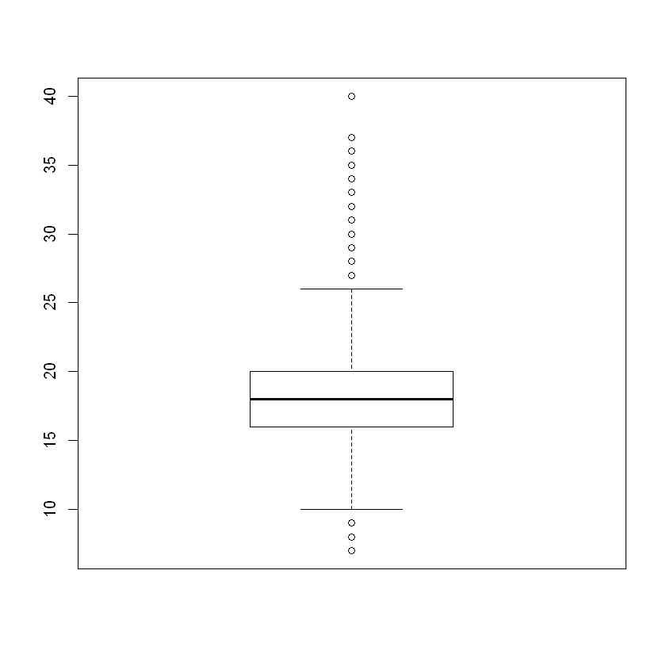
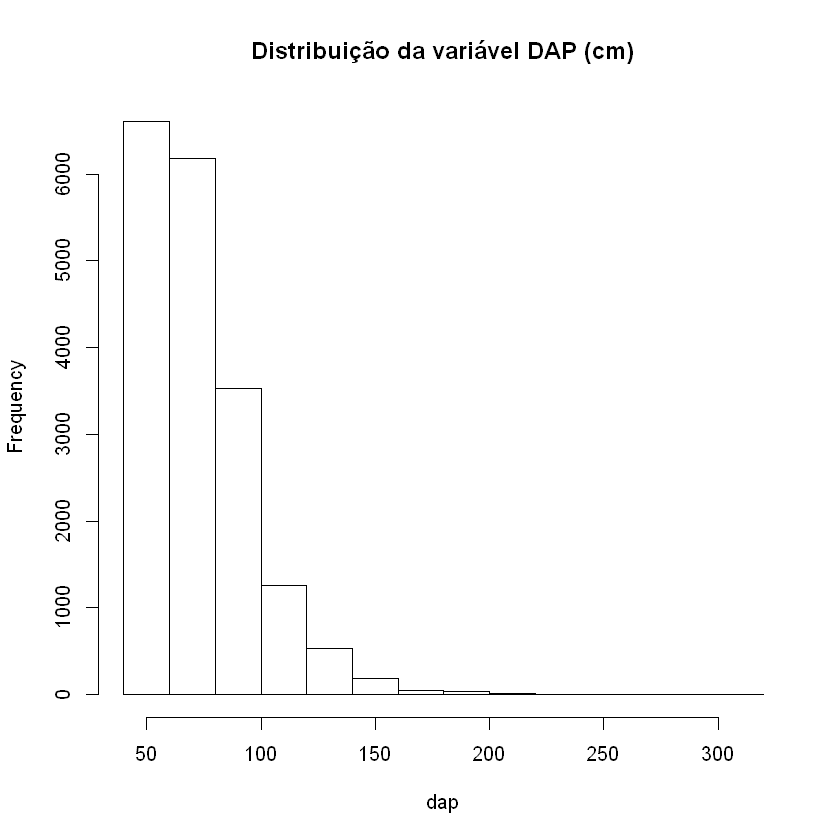
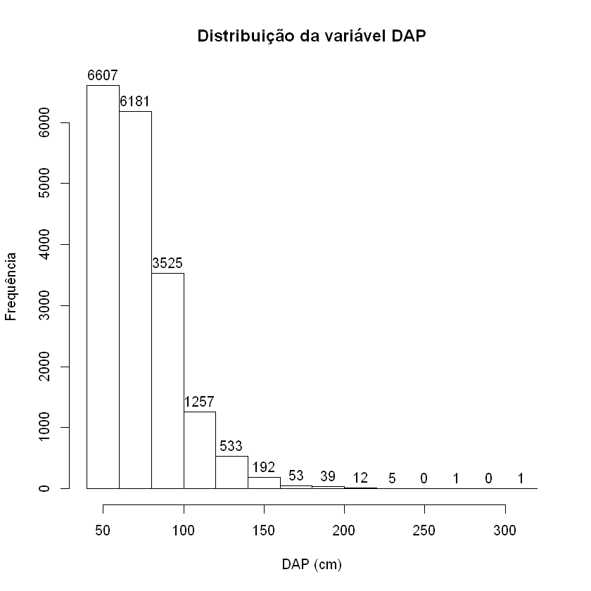
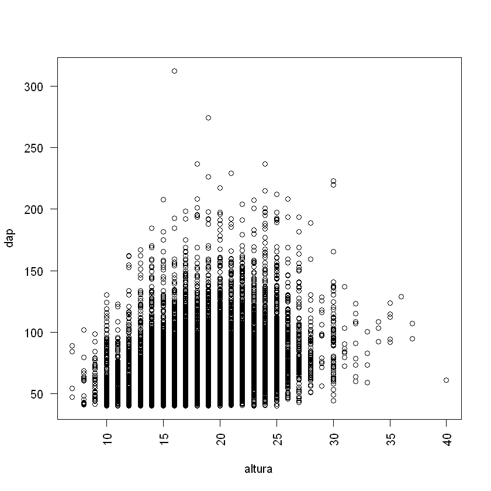
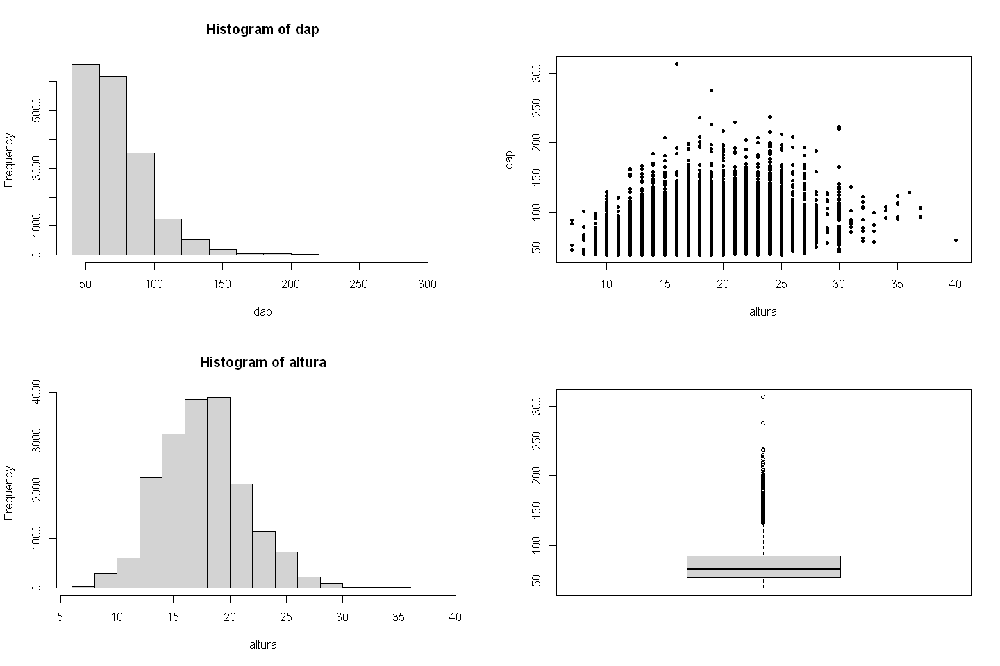

# Operadores Aritméticos e de Atribuição em R

|Operador|Função|
|:------:|:----:|
| +      | Soma |
| -      | Subtração |
| /      | Divisão |
| *      | Multiplicação |
|   %%   | Resto da divisão |
| %/%    | Parte inteira divisão |
| ^      | Potenciação |
| **     | Potenciação |
| <-     | Atribuição |
| =      | Atribuição |


## Exercício Prático - Operadores Aritméticos e de Atribuição

**Instrução 1/3**
* Obter o resto da divisão entre os números inteiros 10 e 3.


```R

```

**Instrução 2/3**
* Obter a parte interira da divisão de 10 por 3.


```R

```

**Instrução 3/3**
* Obter o quadrado de um número inteiro qualquer.


```R

```

# Operadores de Comparação em R

| Operador | Significado |
|:--------:|:-----------:|
| == | igual a |
| != | diferente de |
| >  | maior que |
| <  | menor que |
| >= | maior ou igual a |
| <= |menor ou igual a |


```R

```


TRUE


```R
# Leitura de vetores de um inventário florestal
load('./data/dados_modulo_1.rda')

# Mostrar os objetos atualmente disponíveis no ambiente R
ls()
```


<ol class=list-inline>
	<li>'altura'</li>
	<li>'categoria'</li>
	<li>'dap'</li>
	<li>'nomes_cientificos'</li>
</ol>


```R

```

# Função `mapply()`
Versão multivariada das funções lapply e sapply, utilizada para iterar entre elementos de vetores ou listas.


```R
# Definição dos Vetores a e b
a <- c(7, 12, 5, 2, 1) 
b <- c(4, 2, 3, 5, 1)

# Nomes para os vetores
dias_semana <- c('Segunda', 'Terça', 'Quarta', 'Quinta', 'Sexta')

# Atribuir nome aos vetores
names(a) <- dias_semana
names(b) <- dias_semana

# Uso da função mapply() para retornar a soma
# entre os elementos dos vetores a e b
print(mapply(max, a, b))
```


<style>
.dl-inline {width: auto; margin:0; padding: 0}
.dl-inline>dt, .dl-inline>dd {float: none; width: auto; display: inline-block}
.dl-inline>dt::after {content: ":\0020"; padding-right: .5ex}
.dl-inline>dt:not(:first-of-type) {padding-left: .5ex}
</style><dl class=dl-inline><dt>Segunda</dt><dd>7</dd><dt>Terça</dt><dd>12</dd><dt>Quarta</dt><dd>5</dd><dt>Quinta</dt><dd>5</dd><dt>Sexta</dt><dd>1</dd></dl>


# Função _`tapply()`_
Aplica uma função sobre um vetor com agrupamento em outro vetor categórico. Recebe como parâmetros: um vetor numérico, um vetor categórico e uma função.
O código a seguir aplica a função média sobre o vetor `volume` agrupado ao vetor `ut` (unidades de trabalho)


```R
# Calcular o volume médio por unidade de trabalho
print(tapply(dap, categoria, mean))
```


<style>
.dl-inline {width: auto; margin:0; padding: 0}
.dl-inline>dt, .dl-inline>dd {float: none; width: auto; display: inline-block}
.dl-inline>dt::after {content: ":\0020"; padding-right: .5ex}
.dl-inline>dt:not(:first-of-type) {padding-left: .5ex}
</style><dl class=dl-inline><dt>Explorar</dt><dd>76.8872521591047</dd><dt>Remanescente</dt><dd>67.9580670429674</dd><dt>Substituta</dt><dd>71.9543683510638</dd></dl>


# Testes Lógicos com Vetores
* _`any()`_ Testa se algum elemento do vetor atende a uma condição específica

**Exemplo**: Dado o vetor de nome `dap`, o qual armaneza dados de mensuração de diâmetro de milhares de árvores na Floresta Nacional de Altamira, teste se algum elemento é menor ou igual a 40.


```R
any(dap >= 40)
```


TRUE


* _`all()`_ Testa se todos os elementos de um vetor atendem a uma condição.

**Exemplo:** Dado o vetor de nome `dap`, testar se algum elemento é menor do que 0:


```R
all(dap < 40)
```


FALSE


* `is.na( )` Testa se o vetor contém valores ausentes (_Not Availables_)

## Exercício Prático - Índice de Vetor

Considerando o vetor de nome `dap`, o qual armaneza dados de mensuração de diâmetro de milhares de árvores na Floresta Nacional de Altamira, mostre: 

**Instrução 1/5**
* Quantas árvores foram inventariadas.


```R

```

**Instrução 2/5**
* **Apenas** o penúltimo elemento desse vetor.

**Instrução 3/5**
* O diâmetro mínimo de medição


```R

```

**Instrução 4/5**
* O diâmetro máximo mensurado


```R

```

**Instrução 5/5**
* O diâmetro médio mensurado


```R

```

## Visualização Gráfica de Vetores

<p style="text-align:justify">Hora de tentar algo um pouco diferente. Até agora, você programou <i>script</i> e observou seus dados imprimindo-os. Para uma visualização mais informativa de dados, experimente uma saída gráfica.</p>

<p style="text-align:justify">Para este exercício, você irá trabalhar com dados de inventário florestal realizado em uma unidade de produção anual da Floresta Nacional de Altamira. Para tal utilizaremos apenas duas variáveis, a saber: diâmetro a altura do peito (DAP) e altura comercial.</p>

### Boxplot
O _boxplot_ ou diagrama de caixa é uma ferramenta gráfica da estatística que nos permite visualizar a distribuição e valores discrepantes (outliers) de dados.


```R
boxplot(altura)
```

    

    

### Histograma
Utilziamos histogramas para visualizar a distribuição de uma variável contínua. Em R o pacote "base" nos fornece a função `hist( )`.

**Exercício Prático**

* Mostrar o histograma para os dados da variável DAP disponível no vetor `dap`


```R
hist(dap)
```


    

    


### Gráfico Dispersão
O gráfico de dispersão é utilizado para visualizar a relação entre duas variáveis contínuas.
Para gerar um gráfico de dispersão em R devemos utilizar a função `plot` do pacote "base".

**Exercício Prático**

Visualizar a relação entre a varíavel altura e diâmetro.


```{r fig.align = 'center'}
plot(altura, dap)
```


    

    


## Modificar a Aparência dos Gráficos
<p style="text-align:justify">A configuração dos parâmetros de estilo, tamanho e agrupamento dos gráficos pode ser obtida digitando o comando <mark style="background-color:#F4F4F4">?
    par</mark>. Para este curso introdutório utilizaremos apenas o básico da configuração da aparecência de gráficos no pacote "base" do R.</p>

### Personalizando Histogramas

* `main` Utilizado para atribuir ou modificar um título do gráfico


```{r fig.align = 'center'} 
# Modificar o título do gráfico
hist(dap, main = 'Distribuição da variável DAP (cm)')
```


    

    


* `xlab` e `ylab` - Modificar os nomes dos eixos x e y.


```{r fig.align = 'center'}
# Modificar os rótulos dos eixos x e y
hist(dap, 
     main = 'Distribuição da variável DAP', # título do gráfico
    xlab = 'DAP (cm)',   # Rótulo do eixo x
    ylab = 'Frequência') # Rótulo do eixo y
```


    

    


* `labels` - Mostra os valores de cada barra do histograma. 


```{r fig.align = 'center'}
hist(dap, 
     main = 'Distribuição da variável DAP',
    xlab = 'DAP (cm)',
    ylab = 'Frequência',
    labels = TRUE)
```


    

    


* `col` - Muda a cor das barras do histograma.


```{r fig.align = 'center'}
hist(dap, 
     main = 'Distribuição da variável DAP',
    xlab = 'DAP (cm)',
    ylab = 'Frequência',
    labels = TRUE,
    col = 'darkgreen')
```


    

    


* `density` e `angle` - Mostram as barras do histograma hachuradas


```{r fig.align = 'center'}
hist(dap, 
     main = 'Distribuição da variável DAP',
    xlab = 'DAP (cm)',
    ylab = 'Frequência',
    labels = TRUE,
    col = 'steelblue',
    density = 15,
    angle = 60)
```


    

    


* `Abline( )` - Função para adicionar uma linha reta ao histograma. Para adicionar uma linha vertical deve-se utilizar o argumento `v` e para linha horizontal `h`. O tipo de linha é modificado através do argumento `lty` (_line type_) e a espessura da linha através do argumento `lwd` (_line width_).

O exemplo a seguir mostra como adicionar uma linha ao histograma para representar a média dos diâmetros.


```{r fig.align = 'center'}
hist(dap, 
     main = 'Distribuição da variável DAP',
    xlab = 'DAP (cm)',
    ylab = 'Frequência',
    labels = TRUE,
    col = 'steelblue',
    density = 15,
    angle = 60)

abline(v = mean(dap),
       col = 'red', 
       lty = 2, 
       lwd = 2)
```


    

    


### Personalizando Gráficos de Dispersão

* `pch` - Altera o tipo de caractere dos pontos


* Forma, Tamanho e Cor dos Pontos

Argumento | Saída
:--------:|:------:
`col` | Cor da borda do ponto.
`bg` | Cor do Fundo do ponto.
`cex` | Tamanho do ponto.
`lwd` | Espessura da Borda do Ponto.


```{r fig.align = 'center'}
# Alterar o tipo de caractere dos pontos
plot(altura, dap, pch = 25)
```


    

    


* `las` (_label style_) - Rotação dos rótulos dos eixos x e y.

`las` | Rótulo
:----:|:------:
0     | Paralelo aos eixos
1     | Sempre na Horizontal
2     | Sempre na Perpendicular
3     | Sempre na Vertical


```{r fig.align = 'center'}
plot(altura, dap, pch = 21, las = 0)
```


    

    


```{r fig.align = 'center'}
plot(altura, dap, pch = 21, las = 2)
```


    

    


### Agrupar Gráficos em uma Única Figura


```{r fig.align = 'center'}
# Parâmetros gráficos
par(mfcol = c(2, 2))

hist(dap, pin = c(12, 8))
hist(altura)
plot(altura, dap, pch = 20)
boxplot(dap)
```


    

