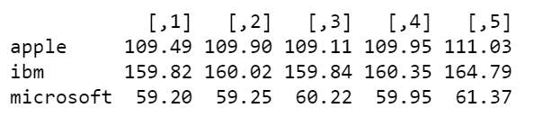
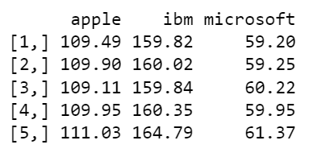
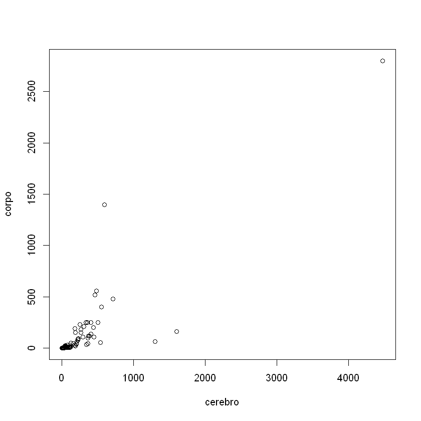

# Matriz
Matriz é uma estrutura de dados semelhante a vetor, exceto que na matriz temos 2 dimensões, uma para as linhas e outra para as colunas. O código a seguir mostra a criação de uma matriz 3x3.


```{r}
matriz <- matrix(1:9, nrow = 3, ncol = 3)
matriz
```


1	4	7

2	5	8

3	6	9


## Somar linhas e Colunas de uma Matriz

A função `apply`, parte do pacote `base` do R, pode ser usada para aplicar uma determinada função a uma matriz, e recebe 3 argumentos como parâmetro: a matriz contendo os dados, a indicação do sentido de aplicação da função, representado pelos números 1 (linha) ou 2 (coluna) e a função a ser aplicada.

Somar as linhas de uma matriz:


```R
print(apply(matriz, 1, sum))
```

    [1] 12 15 18
    

Somar os valores das colunas de uma matriz:


```R
print(apply(matriz, 2, sum))
```

    [1]  6 15 24
    

## Somar os Elementos da Diagonal de uma Matriz


```R
m <- matrix(1:9, nrow = 3, ncol = 3)
print(m)
```

         [,1] [,2] [,3]
    [1,]    1    4    7
    [2,]    2    5    8
    [3,]    3    6    9
    


```R
sum(diag(m))
```


15


## Sentido de Preenchimento dos Dados em uma Matriz
A função `matrix()` tem por padrão o preenchimento no sentido das colunas, porém, em alguns casos podemos necessitar preencher uma matriz no sentido das linhas, para isso devemos definir o valor do argumento `byrow = TRUE`


```R
matriz <- matrix(1:9, nrow = 3, ncol = 3, byrow = TRUE)
print(matriz)
```

         [,1] [,2] [,3]
    [1,]    1    2    3
    [2,]    4    5    6
    [3,]    7    8    9
    

## Atribuir Nomes as Linhas e Colunas de uma Matriz 


```R
matriz <- matrix(1:9, nrow = 3, ncol = 3, byrow = TRUE)
print(matriz)
```

         [,1] [,2] [,3]
    [1,]    1    2    3
    [2,]    4    5    6
    [3,]    7    8    9
    


```R
# Atribuir Nomes as Linhas da matriz
rownames(matriz) <- c('Linha 1', 'Linha 2', 'Linha 3')
```


```R
print(matriz)
```

            [,1] [,2] [,3]
    Linha 1    1    2    3
    Linha 2    4    5    6
    Linha 3    7    8    9
    


```R
# Atribuir Nomes as colunas da matriz
colnames(matriz) <- c('Coluna 1', 'Coluna 2', 'Coluna 3')
```


```R
matriz
```


	        Coluna 1 Coluna 2 Coluna 3
	
Linha 1	 1	2	3

Linha 2	 4	5	6

Linha 3	 7	8	9


## Obter os nomes das Linhas e Colunas de uma Matriz

**Somente os Nomes das Linhas**


```R
rownames(matriz)
```


<ol class=list-inline>
	<li>'Linha 1'</li>
	<li>'Linha 2'</li>
	<li>'Linha 3'</li>
</ol>


**Somente os Nomes das Colunas**


```R
colnames(matriz)
```


<ol class=list-inline>
	<li>'Coluna 1'</li>
	<li>'Coluna 2'</li>
	<li>'Coluna 3'</li>
</ol>


**Nomes das Linhas e Colunas**


```R
dimnames(matriz)
```


<ol>
	<li><ol class=list-inline>
	<li>'Linha 1'</li>
	<li>'Linha 2'</li>
	<li>'Linha 3'</li>
</ol>
</li>
	<li><ol class=list-inline>
	<li>'Coluna 1'</li>
	<li>'Coluna 2'</li>
	<li>'Coluna 3'</li>
</ol>
</li>
</ol>


## Acessar Linhas e Colunas da Matriz


```R
# mostrar a primeira linha da matriz
print(matriz[1, ])
```

    [1] 1 2 3
    


```R
# mostrar a segunda Coluna da matriz
print(matriz[, 2])
```

    [1] 2 5 8
    

## Acessar Elementos da Matriz


```R
# Mostrar o elemento pertencente a segunda linha e segunda coluna
print(matriz[2, 2])
```

    [1] 5
    

## Alterar os Elementos de uma Matriz


```R
# alterar o elemento da linha 2 coluna 2, número 5, para 0
matriz[2, 2] <- 0
print(matriz)
```

         [,1] [,2] [,3]
    [1,]    1    2    3
    [2,]    4    0    6
    [3,]    7    8    9
    

## Operações com Matrizes

### **Maior e menor valor entre os elementos da matriz**


```R
# maior valor entre os elementos da matriz
max(matriz)
```


9


```R
# menor valor entre os elementos da matriz
min(matriz)
```


0


### **Maior e menor valor de uma linha ou coluna da matriz**


```R
# maior valor entre os elementos da primeira linha
max(matriz[1,])
```


3


```R
# menor valor entre os elementos da terceira coluna
min(matriz[,3])
```


3


### **Média dos elementos da matriz**


```R
mean(matriz)
```


4.44444444444444


### **Somar os valores das linhas e colunas**

### **Soma de elementos da matriz**


```R
# somar os valores da primeira linha
sum(matriz[1, ])
```


6


```R
# somar os valores da terceira coluna
sum(matriz[, 3])
```


18


```R
# somar os elementos da segunda linha da matriz
sum(matriz[2, ])
```


10


### **Diagonal da matriz**


```R
# Obter a diagonal da matriz
print(diag(matriz))
```


[1] 1 0 9


```R
# Obter a soma entre os elementos da diagonal da matriz
sum(diag(matriz))
```


10


### **Transposição de Matriz**


```R
# Transpor a matriz
t(matriz)
```


1	4	7
2	0	8
3	6	9


### **Soma entre matrizes**


```R
# Definição das matrizes "a" e "b"
a <- matrix(1:6, nrow = 3, byrow = TRUE)
b <- matrix(1:6, nrow = 3, byrow = TRUE)

print(a)
print(b)
```

         [,1] [,2]
    [1,]    1    2
    [2,]    3    4
    [3,]    5    6
         [,1] [,2]
    [1,]    1    2
    [2,]    3    4
    [3,]    5    6
    


```R
# soma das matrizes a e b
a + b
```


     [,1] [,2]
[1,]    1    2
[2,]    3    4
[3,]    5    6
     [,1] [,2]
[1,]    1    2
[2,]    3    4
[3,]    5    6


## Combinar Vetores em Matriz
Em R podemos combinar vetores para formar uma matriz em que cada vetor fará parte de uma coluna ou linha da matriz. Para combinar vetores em linhas matriciais usamos a função `rbind()`, e para combinar vetores em colunas da matriz usamos a função `cbind()`.
O exemplo a seguir mostra como combinas três vetores com orientação nas linhas de uma matriz.


```R
# Vetor referente a uma amostra de valores de ações da Apple
apple <- c(109.49, 109.90, 109.11, 109.95, 111.03)

# Vetor referente a uma amostra de valores de ações da IBM
ibm <- c(159.82, 160.02, 159.84, 160.35, 164.79)

# Vetor referente a uma amostra de valores de ações da Microsoft
microsoft <- c(59.20, 59.25, 60.22, 59.95, 61.37)

# combinar os vetores em uma matriz onde cada linha receberá os valores dos vetores
print(rbind(apple, ibm, microsoft))
```




A seguir é demonstrado como combinar os elementos de vetores em colunas de uma matriz.


```R
# combinar os vetores em uma matriz onde cada coluna receberá os valores dos vetores
cbind(apple, ibm, microsoft)
```





## Matriz de Correlação
Como exemplo prático para demonstrar o uso de matriz para cálcular a correlação entre variáveis, usaremos os dados referente a publicação:

Ramsey, F.L. and Schafer, D.W. (2013). _The Statistical Sleuth_: A Course in Methods of Data Analysis (3rd ed), Cengage Learning.

Os dados são os valores médios de peso cerebral (g), peso corporal (g), duração da gestação (dias) e tamanho da prole de 96 espécies de mamíferos.


```R
# Carregar os dados vetoriais
load('./data/dados_modulo_1_aula_3.rda')

# listar os objetos no ambiente R
ls()
```


<ol class=list-inline>
	<li>'cerebro'</li>
	<li>'corpo'</li>
	<li>'especies'</li>
	<li>'gestacao'</li>
	<li>'prole'</li>
</ol>


```R
# Combinar os vetores em uma matriz
m <- cbind(cerebro, corpo, gestacao, prole)

# Mostrar as primeiras 6 linhas da matriz
head(m)

# Mostrar as últimas 6 linhas da matriz
tail(m)
```


     cerebro   corpo gestacao prole
     
[1,]     9.6    2.20       31   5.0

[2,]     9.9    0.78       98   1.2

[3,]  4480.0 2800.00      655   1.0

[4,]    20.3    2.80      104   1.3

[5,]   219.0   89.00      218   1.0

[6,]    53.0    6.00       60   2.2

      cerebro corpo gestacao prole
      
[91,]     198  45.0      300   1.1

[92,]     550 400.0      310   1.0

[93,]     179  32.0      180   1.0

[94,]     102   5.5      210   1.0

[95,]     185 150.0      120   4.0

[96,]     334 250.0      255   1.0


## Atribuir um Atributo a uma Matriz
Para inserir um atributo a matriz utilizamos a função `attr()`, passando como argumentos a matriz e um rótulo para nomear o atributo. Como demonstração iremos inserir um atributo a nossa matriz definida anteriormente, este atributo será a referência bibliográfica dos dados.


```R
# Obter os atributos da matriz
attributes(m)
```

$dim
[1] 96  4

$dimnames
$dimnames[[1]]
NULL

$dimnames[[2]]
[1] "cerebro"  "corpo"    "gestacao" "prole"   


$Fonte
[1] "Ramsey, F.L. and Schafer, D.W. (2013). The Statistical Sleuth: A Course in Methods of Data Analysis (3rd ed), Cengage Learning."


```R
# Inserir o atributo
attr(m, 'Fonte') <- 'Ramsey, F.L. and Schafer, D.W. (2013). The Statistical Sleuth: A Course in Methods of Data Analysis (3rd ed), Cengage Learning.'
```


```R
# conferir os atributos da matriz
attributes(m)
```


$dim
[1] 96  4

$dimnames
$dimnames[[1]]
NULL

$dimnames[[2]]
[1] "cerebro"  "corpo"    "gestacao" "prole"   


$Fonte
[1] "Ramsey, F.L. and Schafer, D.W. (2013). The Statistical Sleuth: A Course in Methods of Data Analysis (3rd ed), Cengage Learning."


## Gerar Gráficos a partir dos Dados de uma Matriz


```R
# gráfico da relação entre as duas primeiras colunas (cerebro e corpo)
plot(m)
```


    

    


```R
# gráfico da relação entre as duas primeiras colunas (gestacao e prole) 
# plot(m[, 3], m[, 4])
plot(m[,'gestacao'], m[,'prole'])
```


    

    


# Array
Em R array é uma estrutura de dados tridimensional. Criamos um array através da função `array(x, dim)`, onde o parâmetros `x` é um vetor e `dim` são as dimensões do array.


```R
a <- array(c(1:24), dim = c(3, 3, 2))
```


```R
print(a)
```

    , , 1
    
         [,1] [,2] [,3]
    [1,]    1    4    7
    [2,]    2    5    8
    [3,]    3    6    9
    
    , , 2
    
         [,1] [,2] [,3]
    [1,]   10   13   16
    [2,]   11   14   17
    [3,]   12   15   18
    
    

## Acessar Elementos do Array


```R
# Acessar a primeira tabela
a[, , 1]
```


1	4	7
2	5	8
3	6	9


```R
# Acessar a primeira linha da tabela 1
print(a[1, , 1])
```

    [1] 1 4 7
    


```R
# Acessar a primeira coluna da segunda tabela
print(a[, 1, 2])
```

    [1] 10 11 12
    

## Operações com Arrays


```R
# Obter o maior valor da primeira tabela
max(a[, , 1])
```


9


```R
# Obter a soma da primeira coluna da tabela 1
sum(a[, 1, 1])
```


6


```R
# obter a média dos valores da segunda linha da segunda tabela
mean(a[, 2, 2])
```


14


```R
# Obter a soma entre os valores da primeira coluna da table 1 com os da
# primeira coluna da tabela 2
sum(a[, 1, 1], a[, 1, 2])
```


39


```R
# obter a soma dos valores da diagonal da primeira tabele
sum(diag(a[, , 1]))
```


15


## Atribuir Nomes as Dimensões do Array

Assim como podemos atribuir nomes aos elementos de um vetor e as duas dimensões de uma matriz, também é possível o fazer para arrays. Para tal utilizamos a função `dimnames()`, passando como parâmetros três vetores com os nomes das linhas da matriz, nomes das colunas e nomes das matrizes.


```R
a <- array(c(1:24),  # Vetor
           dim = c(3, 3, 2),  # Dimensões do array 
           dimnames = list(c('L1', 'L2', 'L3'),  # Nome das linhas das matrizes
                           c('C1', 'C2', 'C3'),  # Nome das colunas das matrizes
                           c('Matriz 1', 'Matriz 2')))  # Nomes das Matrizes

print(a)
```

    , , Matriz 1
    
       C1 C2 C3
    L1  1  4  7
    L2  2  5  8
    L3  3  6  9
    
    , , Matriz 2
    
       C1 C2 C3
    L1 10 13 16
    L2 11 14 17
    L3 12 15 18
    
    

## Inserir Atributo em um Array


```R
# inserir um atributo ao array "a"
attr(a, 'Observação') <- 'Meu primeiro array em R!!'
```


```R
# checar os atributos do array
print(attributes(a))
```

    $dim
    [1] 3 3 2
    
    $dimnames
    $dimnames[[1]]
    [1] "L1" "L2" "L3"
    
    $dimnames[[2]]
    [1] "C1" "C2" "C3"
    
    $dimnames[[3]]
    [1] "Matriz 1" "Matriz 2"
    
    
    $Observação
    [1] "Meu primeiro array em R!!"
    
